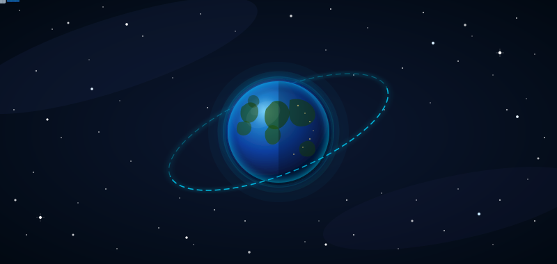
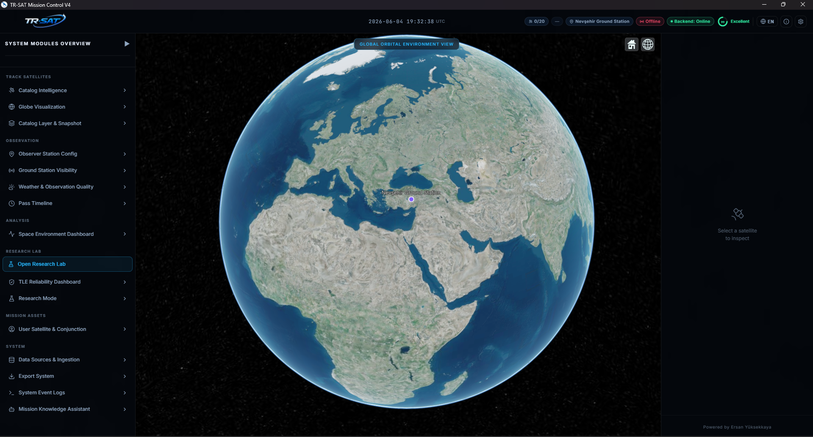
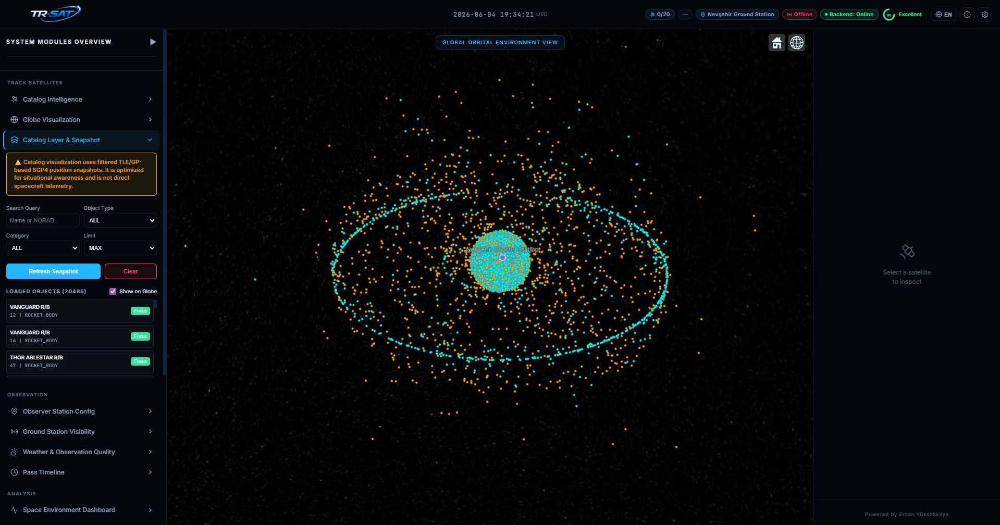
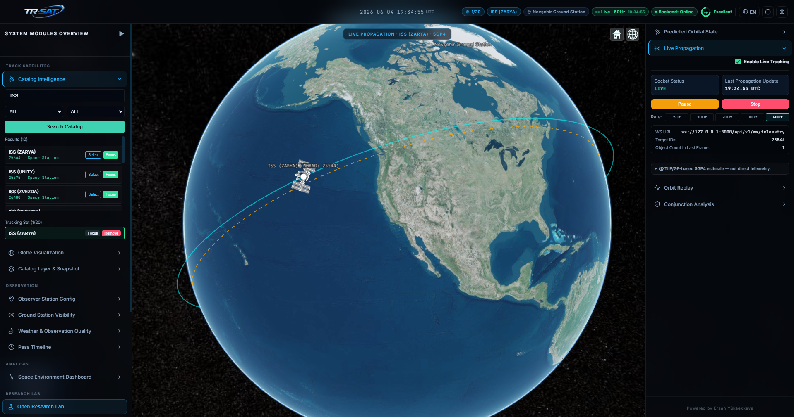
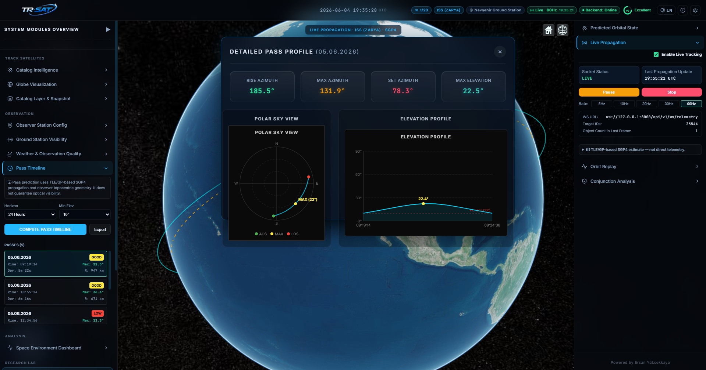
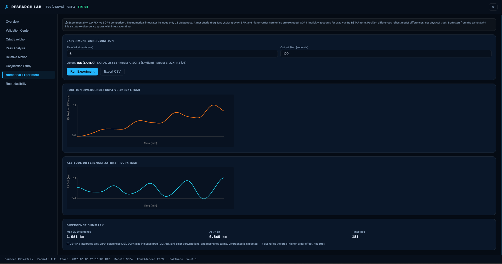
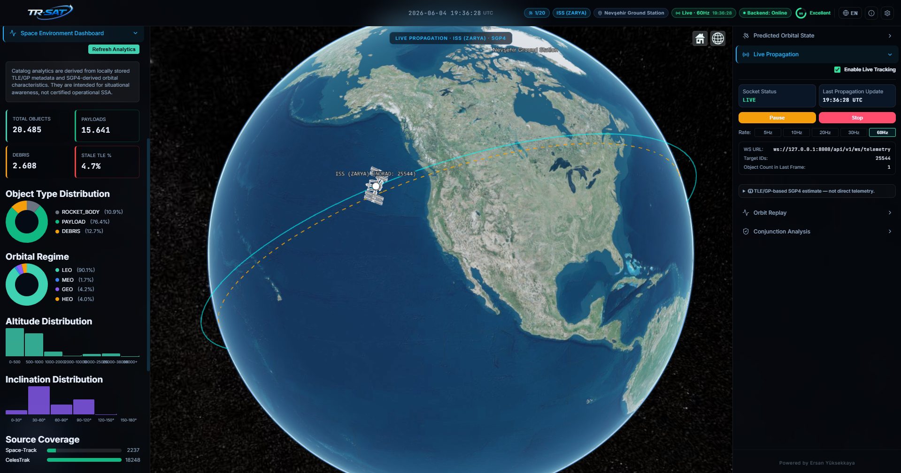

<div align="center">


<br/>

[](https://git.io/typing-svg)

<br/>

<p>
  
  
  
  
</p>

<p>
  
  
  
  
</p>

<p>
  
  
  
  
</p>

<br/>

<a href="https://drive.google.com/uc?export=download&id=1H8oChvThrxfysu-09-tMB59uzF9--BU8">
  
</a>

<br/>

> **TR-SAT Mission Control** is a local-first, open-source Space Situational Awareness (SSA) desktop platform.  
> All astrodynamics computations run entirely on your machine — zero telemetry, zero cloud dependency.

<br/>



<br/>

---

</div>

## 🖼️ &nbsp;Screenshots

<div align="center">

<table>
  <tr>
    <td align="center" width="50%">
      <br/>
      <sub><b>🌍 Mission Control — 3D CesiumJS Globe</b><br/>Main console with aerospace dark theme and full left-dock navigation</sub>
    </td>
    <td align="center" width="50%">
      <br/>
      <sub><b>🌐 Full Catalog — 41,000+ RSO Snapshot</b><br/>All-catalog progressive rendering with orbital shell visualization</sub>
    </td>
  </tr>
  <tr>
    <td align="center" width="50%">
      <br/>
      <sub><b>🛸 Live Tracking — ISS (ZARYA) NORAD 25544</b><br/>Real-time WebSocket telemetry, orbit path, ground track & live state vector</sub>
    </td>
    <td align="center" width="50%">
      <br/>
      <sub><b>🔭 Pass Prediction — Polar Sky View + Elevation Profile</b><br/>AOS/TCA/LOS timeline with azimuth, elevation and range charts</sub>
    </td>
  </tr>
  <tr>
    <td align="center" width="50%">
      <br/>
      <sub><b>🧪 Research Lab — Numerical Experiment</b><br/>SGP4 vs J2+RK4 position divergence & altitude difference over 6h</sub>
    </td>
    <td align="center" width="50%">
      <br/>
      <sub><b>📊 Space Environment Dashboard</b><br/>Object type, orbital regime, altitude & inclination distribution analytics</sub>
    </td>
  </tr>
</table>

</div>

---

## ✦ &nbsp;Feature Overview

<div align="center">

| 🛸 **Orbital Tracking** | 🔭 **Observation** | ⚡ **Analysis** |
|:---:|:---:|:---:|
| SGP4/SDP4 propagation via Skyfield | Observer setup (lat / lon / alt) | Conjunction screening & Pc |
| 41,000+ RSO catalog (CelesTrak & Space-Track) | Pass predictions (AOS / TCA / LOS) | Research Reliability Dashboard |
| Live WebSocket telemetry (5–60 Hz) | Sky View polar chart | Space Environment (Kp, F10.7) |
| 3D CesiumJS globe + orbit path | Ground station visibility | Export (JSON / CSV / TLE) |
| All-catalog snapshot rendering | Weather & observability score | AI Assistant (Gemini) |
| Historical TLE archive | Elevation profile chart | Research Lab — 8 modules |

</div>

---

## 🌌 &nbsp;Architecture

```
╔══════════════════════════════════════════════════════════════════╗
║                        TAURI v2  (Desktop Shell)                 ║
║              Rust process manager · WebView2 native window        ║
╠══════════════════════════╦═══════════════════════════════════════╣
║   FRONTEND               ║   BACKEND                             ║
║   React 18 + TypeScript  ║   FastAPI + Uvicorn                   ║
║   CesiumJS 1.115  (3D)   ║   Python 3.12                         ║
║   Zustand state mgmt     ║   Skyfield 1.54  +  sgp4 2.25         ║
║   Recharts / custom SVG  ║   SQLAlchemy 2.0  +  Pydantic v2      ║
║   i18n  (EN / TR)        ║   Gemini AI integration               ║
║   :5173 (dev)            ║   :8000                               ║
╠══════════════════════════╩═══════════════════════════════════════╣
║             SQLite  (WAL mode)  ·  ~20 MB  ·  41,827 TLE records ║
║                       data/trsat_v3.sqlite                        ║
╚══════════════════════════════════════════════════════════════════╝
```

```
CelesTrak / Space-Track
        │  (HTTP sync — on demand)
        ▼
  [celestrak.py / spacetrack.py]
  TLE · OMM JSON parse + ingest
        │
        ▼
  [SQLite: ResidentSpaceObject + TLERecord]
  source_format · epoch · BSTAR · inc · ecc …
        │
        ▼
  [astrodynamics.py — Skyfield EarthSatellite.at(t)]
  ECEF · ECI · AER · passes · conjunctions
        │
        ▼
  [Zustand Store — React]
  activeObject · activeState · ephemeris
  conjunctionResults · visibilityResults
        │
        ▼
  [CesiumJS Globe + 25 Console Panels]
```

---

## 🔬 &nbsp;Research Lab — 8 Modules

<details>
<summary><b>🔽 &nbsp;Expand Research Lab details</b></summary>

<br/>

| # | Module | What it does |
|---|--------|-------------|
| **1** | 📋 **Overview** | Full object summary · OMM/TLE provenance · derived orbital elements · export `trsat.research_record` v1 |
| **2** | ✅ **Validation Center** | Compare TR-SAT SGP4 prediction vs external reference · Δlat / Δlon / Δalt diff table |
| **3** | 📈 **Orbit Evolution** | Time-series of historical TLEs: mean motion, perigee, apogee, inclination, eccentricity, BSTAR |
| **4** | 🌅 **Pass Analysis** | Research-mode pass predictor · AOS/TCA/LOS table · CSV export |
| **5** | 🔄 **Relative Motion** | Two-object SGP4 separation over time (km vs time Recharts graph) |
| **6** | ☄️ **Conjunction Study** | Browse conjunction results with full Data Provenance strips · bulk JSON export |
| **7** | 🧪 **Numerical Experiment** | J2 + RK4 numerical integrator vs SGP4 analytical model · divergence chart · CSV export |
| **8** | 🔁 **Reproducibility** | Step-by-step guide to reproduce any analysis · all `trsat.*` export schemas documented |

</details>

---

## 📦 &nbsp;Download

<div align="center">

<a href="https://drive.google.com/uc?export=download&id=1H8oChvThrxfysu-09-tMB59uzF9--BU8">
  
</a>

<br/><br/>

> Pre-built Windows installer via Google Drive &nbsp;·&nbsp; No Python or Node.js required &nbsp;·&nbsp; WebView2 runtime included in Windows 11

</div>

---

## 🚀 &nbsp;Quick Start

<details>
<summary><b>🔽 &nbsp;Prerequisites</b></summary>

<br/>

- **Python** 3.10+ (3.12 recommended)
- **Node.js** 18+ with npm
- **Rust** (stable, for Tauri)
- **WebView2** runtime (pre-installed on Windows 11)

</details>

<details>
<summary><b>🔽 &nbsp;Development Mode</b></summary>

<br/>

**1 — Clone & install**

```bash
git clone https://github.com/kingos352/TR-SAT-Desktop.git
cd TR-SAT-Desktop
```

**2 — Backend**

```powershell
cd backend
pip install -r requirements.txt
python -m uvicorn app.main:app --reload --port 8000
```

**3 — Frontend** *(separate terminal)*

```powershell
cd frontend
npm install
npm run dev
```

**4 — Tauri Desktop** *(separate terminal)*

```powershell
cd src-tauri
cargo tauri dev
```

> **Shortcut:** Run `scripts\windows\TR-SAT-Start.ps1` to launch all three processes at once.

</details>

<details>
<summary><b>🔽 &nbsp;Run Tests</b></summary>

<br/>

```powershell
cd backend
pytest tests/ -v
```

Test suite covers: TLE parser · SGP4 propagation · catalog API · pass predictor · conjunction screening · observer AER · telemetry WebSocket · Space-Track integration · advanced research endpoints · reliability analysis.

</details>

---

## 🛰️ &nbsp;Backend API Reference

<details>
<summary><b>🔽 &nbsp;Expand all endpoints</b></summary>

<br/>

**Propagation**

| Method | Path | Description |
|--------|------|-------------|
| `POST` | `/api/v1/propagation/state` | Instantaneous state from raw TLE |
| `POST` | `/api/v1/propagation/ephemeris` | Ephemeris from raw TLE |
| `POST` | `/api/v1/propagation/catalog/state` | State by NORAD ID |
| `POST` | `/api/v1/propagation/catalog/ephemeris` | Ephemeris by NORAD ID |
| `POST` | `/api/v1/propagation/catalog/eci-state` | ECI initial state vector (Skyfield GCRS) |
| `POST` | `/api/v1/propagation/catalog/eci-ephemeris` | ECI time series for J2+RK4 comparison |

**Catalog**

| Method | Path | Description |
|--------|------|-------------|
| `GET` | `/api/v1/catalog/search` | Full-text + filter search |
| `GET` | `/api/v1/catalog/object/{norad_id}` | Single object detail |
| `POST` | `/api/v1/catalog/sync` | CelesTrak group sync |
| `GET` | `/api/v1/catalog/historical-tles/{norad_id}` | Historical TLE archive |

**Visibility & Pass**

| Method | Path | Description |
|--------|------|-------------|
| `POST` | `/api/v1/visibility/passes` | Pass predictions (AOS/TCA/LOS) |
| `POST` | `/api/v1/visibility/detailed-passes` | Passes + elevation profile |
| `POST` | `/api/v1/visibility/aer` | Azimuth / Elevation / Range |

**Conjunction & Analysis**

| Method | Path | Description |
|--------|------|-------------|
| `POST` | `/api/v1/conjunction/screen` | Catalog-wide conjunction scan |
| `POST` | `/api/v1/conjunction/debris-watch` | Debris risk monitoring |
| `POST` | `/api/v1/analysis/relative-motion` | Two-object relative motion |
| `GET`  | `/api/v1/analysis/reliability` | TLE freshness summary |

</details>

---

## ⚠️ &nbsp;Scientific Limitations

> TR-SAT is an **analytical SGP4-based** platform intended for **educational and research purposes.**  
> It is **not** a certified operational space surveillance system.

| Limitation | Detail |
|-----------|--------|
| **SGP4 precision** | km-level errors within hours at LEO; no planetary/luni-solar perturbations |
| **TLE age** | Accuracy degrades rapidly with TLE age — always check epoch freshness |
| **Pc (collision probability)** | Heuristic geometric estimate only; **no covariance matrix** — not CDM-class |
| **Atmospheric drag** | No real-time F10.7 / Kp feedback into BSTAR |
| **ECI frame** | Uses GCRS; exact TEME ↔ J2000 conversion not applied |
| **Real telemetry** | No actual uplink/downlink data from any satellite |

---

## 🧩 &nbsp;Tech Stack

<div align="center">

<p>
  
  
  
  
  
  
</p>

<p>
  
  
  
  
  
  
</p>

<p>
  
  
  
  
</p>

</div>

---

## 📡 &nbsp;Data Sources

<div align="center">

| Source | Data | Auth |
|--------|------|------|
| [CelesTrak](https://celestrak.org) | Active satellites, stations, debris, Starlink, GPS, Galileo, OneWeb | None required |
| [Space-Track](https://www.space-track.org) | Full GP catalog (41,000+ objects), OMM JSON | Free account |
| [Open-Meteo](https://open-meteo.com) | Local weather for observability scoring | None required |
| NOAA Space Weather | Kp index, solar flux (F10.7), geomagnetic data | None required |

</div>

---

## 📂 &nbsp;Project Structure

```
TR-SAT-Desktop/
├── frontend/
│   └── src/
│       ├── components/
│       │   ├── Console/          # 25+ panel components
│       │   │   └── Charts/       # Recharts wrappers
│       │   ├── Globe/            # CesiumJS viewer
│       │   ├── ResearchLab/      # 8-module research workspace
│       │   └── About/            # Disclaimer modal
│       ├── store/                # Zustand state slices
│       ├── api/                  # API client (client.ts)
│       └── i18n/                 # EN + TR translations
├── backend/
│   └── app/
│       ├── api/endpoints/        # FastAPI route handlers
│       ├── services/             # Astrodynamics, catalog, AI …
│       ├── models/               # SQLAlchemy ORM models
│       └── schemas/              # Pydantic request / response
├── src-tauri/                    # Tauri v2 Rust configuration
├── scripts/windows/              # PowerShell build & start scripts
└── data/                         # SQLite database (git-ignored)
    └── trsat_v3.sqlite           # ~20 MB · 41,827 TLE records
```

---

## 🗺️ &nbsp;Roadmap

<details>
<summary><b>🔽 &nbsp;View roadmap</b></summary>

<br/>

**🔵 Short-term (low risk)**
- [ ] CSS token-based UI scale system (Compact / Standard / Large)
- [ ] Catalog format badge (TLE / OMM) per object in results list
- [ ] Luni-solar perturbation terms in Numerical Experiment
- [ ] Dark / Light theme toggle

**🟡 Medium-term**
- [ ] Auto background TLE refresh (APScheduler, every 6 h)
- [ ] Multi-object relative motion cluster analysis (Starlink / OneWeb)
- [ ] Historical conjunction analysis (past-date TLE archive)
- [ ] Multi-ground-station coverage Gantt chart
- [ ] OEM / CDM import pipeline (CCSDS format)

**🔴 Long-term**
- [ ] Production installer (PyInstaller → NSIS/MSI)
- [ ] GitHub Actions CI (test + build workflow)
- [ ] Offline bootstrap TLE bundle (no internet on first launch)
- [ ] Covariance propagation (STM-based real Pc)

</details>

---

## 📜 &nbsp;License

Released under the **MIT License** — see [`LICENSE`](LICENSE) for details.

Data from CelesTrak and Space-Track is subject to their respective terms of service.  
This software is provided for **educational and research purposes only**.

---

<div align="center">


<br/>

[](https://git.io/typing-svg)

<br/>

<p>
  
</p>

</div>
